# A Level Biology: Biological Molecules Test

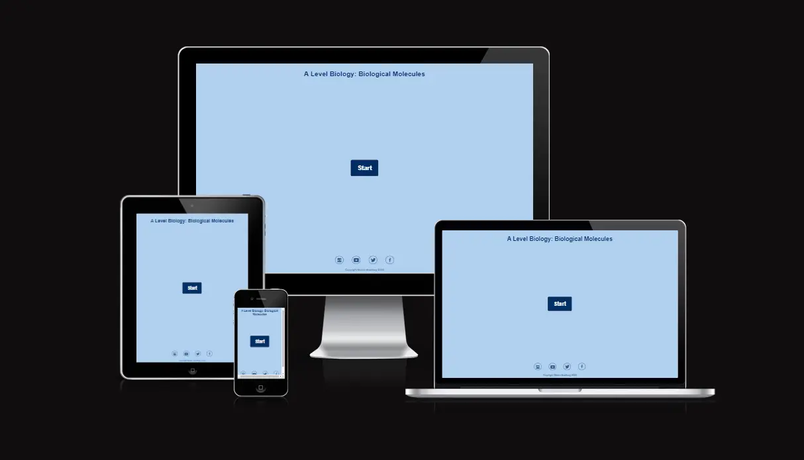

This interactive A Level Biology Biological Molecules test is aimed at Year 12 and 13 students who want to test their knowledge on the topic of Biological Molecules. The test will consist of 20 questions and will test the users knowledge across Carbohydrates, Lipids and Water. The user will be faced with a questions in a random order and 4 possible options to select from. Once selected the user will get instant feedback if they are correct or incorrect. If incorrect the correct answer will be displayed. For each question the user will get a maximum of 15 seconds to respond and this will be displayed as a number counting down and a timer bar that will decrease as the time progresses. At the end of the test the user will be able to see how many answers they got correct, what their percentage is and a conversion of that percentage into a grade based on typical A Level grade boundaries.

# Contents

- [A Level Biology: Biological Molecules Test](#a-level-biology-biological-molecules-test)
- [Contents](#contents)
- [Target Audience](#target-audience)
- [User Expectations](#user-expectations)
- [User Stories](#user-stories)
- [Design](#design)
  - [Typography](#typography)
  - [Color Scheme](#color-scheme)
- [Features](#features)
  - [Existing Features:](#existing-features)
    - [Header and Footer](#header-and-footer)
    - [Interactive Start Button](#interactive-start-button)
    - [Question number in the Test Area](#question-number-in-the-test-area)
    - [Timer bar and number](#timer-bar-and-number)
    - [Selecting correct answer](#selecting-correct-answer)
    - [Incorrect answer selection](#incorrect-answer-selection)
    - [Results Area](#results-area)
    - [Random Question Order Generation](#random-question-order-generation)
    - [Random Answer Order Generation](#random-answer-order-generation)
  - [Features Left To Implement and Future Development](#features-left-to-implement-and-future-development)
    - [Below are features that I would like to integrate into the project:](#below-are-features-that-i-would-like-to-integrate-into-the-project)
  - [Wireframes](#wireframes)
  - [Framework, Languages and Programs Used](#framework-languages-and-programs-used)
- [Testing](#testing)
  - [Validator testing:](#validator-testing)
  - [Unfixed Bugs](#unfixed-bugs)
  - [Lighthouse results](#lighthouse-results)
    - [Mobile](#mobile)
    - [Desktop](#desktop)
  - [Responsiveness](#responsiveness)
  - [Features Tested](#features-tested)
- [Deployment](#deployment)
- [Credits](#credits)
- [Acknowledgements](#acknowledgements)
- [Modificatio following assesor feedback.](#modificatio-following-assesor-feedback)
  - [API to generate questions](#api-to-generate-questions)
  - [Quiz categories](#quiz-categories)
  - [Quiz difficulty](#quiz-difficulty)
  - [Option array sort](#option-array-sort)
  - [Quiz Category Heading](#quiz-category-heading)

# Target Audience
*   This test is aimed at students who are currently studying A Level Biology. It is intended as a quick knowledge check to test understanding and retention of the content taught. It can also be used a fun test for people who studied A level Biology in the past and want to see how much they can remember. 
  
# User Expectations
*   This is a interactive test that is able to be completed on desktop, tablet and mobile devices.
*   The Test will load quickly on all devices. 
*   The test is fully responsive. 
*   Feedback from each question attempted. 
*   Clear indication of time left to answer each question via a timer bar and number.
*   Clear indication of which question they are on and how many questions in total. 
*   Overall feedback with a mark, percentage and grade at the end inline with OCR specification.
*   The ability to restart the test once completed. 

# User Stories

* As a visitor:

    * I am looking for a easy to navigate test the is responsive and easy to interact with on all devices.
    * I will see a start button and a header detailing the content and module of the test. 
    * I will click start and see the instructions for the test.
    * The instructions will be clearly laid out and easy to follow. 
    * I will see two buttons at the bottom of the rules inviting me to start the test or quit.
    * The test will begin when I click the start button. 
    * I will see the question number and total at the top of the test area.
    * I will see a timer bar indicating how long I have left on that question. 
    * I will see a timer number counting down to show how long I have left on that question. 
    * I will see the question being asked. 
    * I will see 4 possible answers.
    * Once an answer is selected I will see if I am correct instantly by showing the answer selected in green.
    * If incorrect I will see my answer selected turn red and the correct answer shown in green. 
    * The next button will appear when I have selected an answer and the timer and timer bar will stop. 
    * I will complete all 20 questions.
    * After completing all 20 questions a results window will appear showing me my over all score, percentage and grade achieved. 
    * I am able to restart the test again
    * The question order and options in each question will be random.
    * I can see links in the footer to social media. 

# Design

## Typography
*   For my font I chose Lato which was imported from Google fonts. I chose this font as it is simple and clear to read. The purpose of the test is to test knowledge and I did not want a font that distracts away from this and is challenging to read on any device.
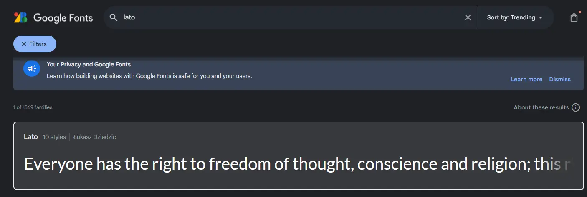

## Color Scheme
- I chose a very simple color scheme that was consistent throughout the test. Text was black for the question on a white background and button text is white alternating to background blue color on hover effect. The focus of the test is to help the user test their biological knowledge. I did not want a design and color scheme that distracted away from this purpose. The color scheme is displayed in the features section below.

# Features

## Existing Features:

### Header and Footer
*   Header element detailing the quiz title and a interactive footer that will direct users to my social media sites.

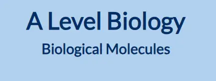

### Interactive Start Button
*   The users will be greeted on the home page with a interactive start button that has a hover effect and opens up the rules window when clicked.

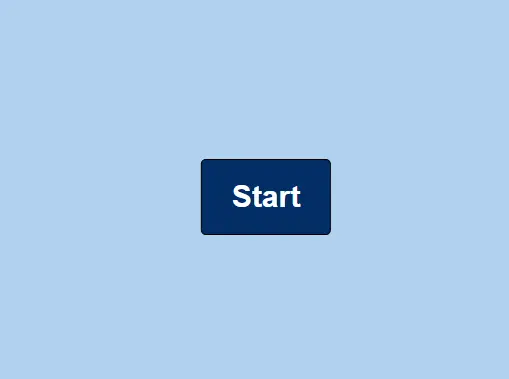  
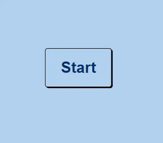
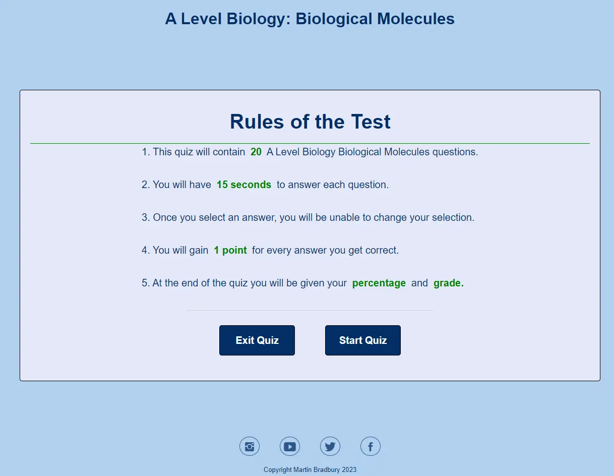

### Question number in the Test Area
*   The users will see the question number they are on and how many questions there are in the header of their test.

### Timer bar and number
*   The user will see how many seconds left there are to answer the current question. This will also be displayed in a timer bar.

### Selecting correct answer
*   Selecting the correct answer will stop the timer and timer bar, display the answer as green and display a button to move to the next question
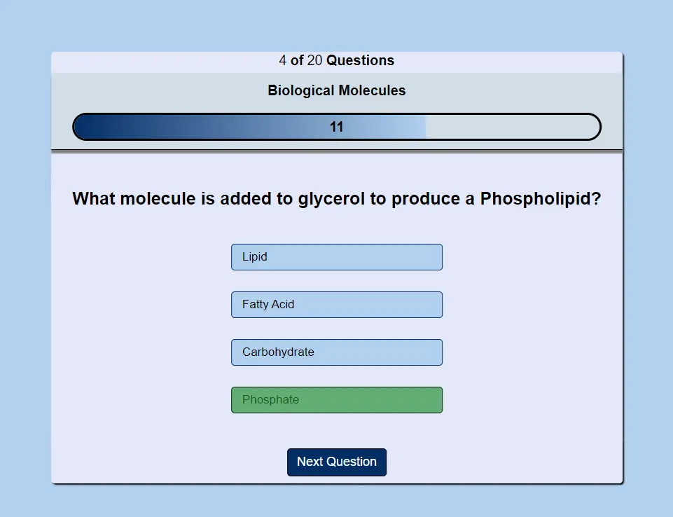

### Incorrect answer selection
*   Selecting an incorrect answer will stop the timer and the timer bar, display the incorrect answer selected as red and the correct answer green.

### Results Area
*   The results area will show the total number of questions correct, calculate the percentage, and use the percentage to generate a grade for the user based on OCR A level Biology Grade boundaries.
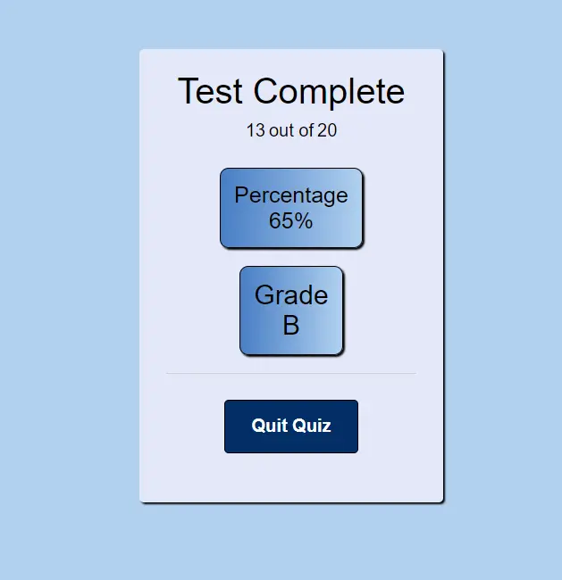

### Random Question Order Generation
*   The 20 questions in the quiz appear in a random order every time the test is attempted to ensure the user does not just learn the sequence of answers.
 

### Random Answer Order Generation
*   The answers will appear in a random order for each question every time the test is attempted. This ensures the user does not just learn the sequence of answers.

## Features Left To Implement and Future Development
### Below are features that I would like to integrate into the project:
*   Greater selection of questions and / or the use of an API to generate the questions.
*   Submit test result section. This will be very useful as a teacher if the students are able to submit their answers directly to me and those answers could be tabulated.
*   Multiple topics for the students to choose from throughout the whole A level Biology specification.
*   Level of difficulty questions that the student can select which will in turn dictate the demand of the questions being asked.
*   Responsive test design which selects the next question based on the success of the student in the previous few questions.

## Wireframes

*   Main page:
[Design](assets/images/home.webp) 
*   Instructions:
[Design](assets/images/instructions.webp) 
*   Test Area:
[Design](assets/images/questions.webp) 
*   Results Area:
[Design](assets/images/results.webp) 

## Framework, Languages and Programs Used

1. [Bootstrap 4.1](https://getbootstrap.com/docs/4.1/getting-started/introduction/)
   *Bootstrap was used to help make the website more responsive and aid with the styling of the website.
  
2. [Google Fonts](https://fonts.google.com/)
   *Google Fonts was used to import different font styles to be used in styling of the website.
  
3. [Git](https://git-scm.com/)
   *Git was used to store the projects code after being pushed from Git.

4. [GitHub](https://github.com/)
   *GitHub is used to store the projects code after being pushed from Git.

5. [Adobe Xd](https://helpx.adobe.com/support/xd.html)
   *Xd was used to create the wire frames for the project.

6. [Javascript](https://www.javascript.com/)
   *Javascript was used to create the interactive elements on the website and Quiz.

# Testing

*   The website and interactive quiz has been tested through the following methods below. These tests have taken place on the hosted server during development and on the deployed site on GitHub Pages. After deploying the website to GitHub pages the website was further tested by friends, family and students at my school to check its UX and functionality on both desktop computers and the variety of mobile devices.

## Validator testing:

* [HTML:](https://validator.w3.org/)
    *   No errors were found when testing with the W3C HTML Validator. 

*   [CSS:](https://validator.w3.org/)
    *   No errors were found when testing with the W3C CSS Validator. 

*   [Javascript:](https://jshint.com/)
    *   No errors were found when testing with the JSHunt Validator. [JSValidator]
        * The following metrics were returned:
        * There are 16 functions in this file.
        * Function with the largest signature take 2 arguments, while the median is 0.
        * Largest function has 26 statements in it, while the median is 3.
        * The most complex function has a cyclomatic complexity value of 8 while the median is 1.

## Unfixed Bugs
*   On desktop devices: Tabbing out of the test once started loses the window focus. This causes the timer bar to stop counting down. The numbers work correctly. This will be corrected in the future by ensuring when the test has started, the window is always the focus even if tabbed out.

## Lighthouse results

*   I have used the developer tools in google chrome to test each page in my website for performance, accessibility, best practise and SEO. Below is an example of the homepage.

### Mobile
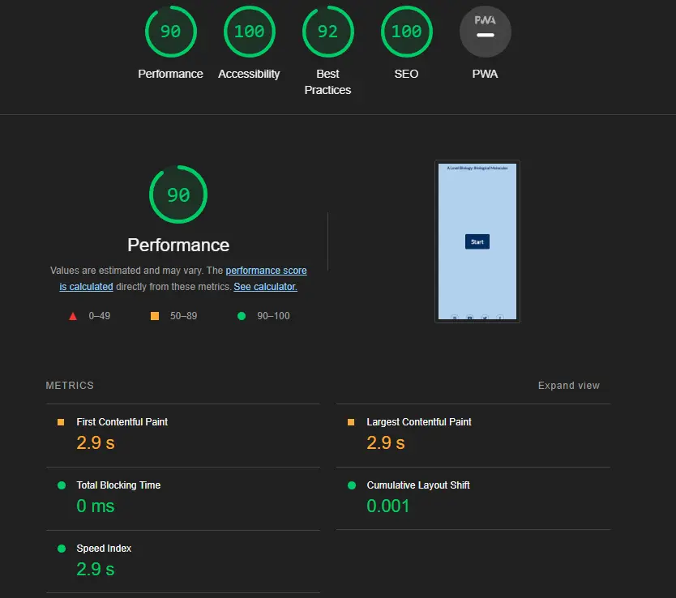
### Desktop
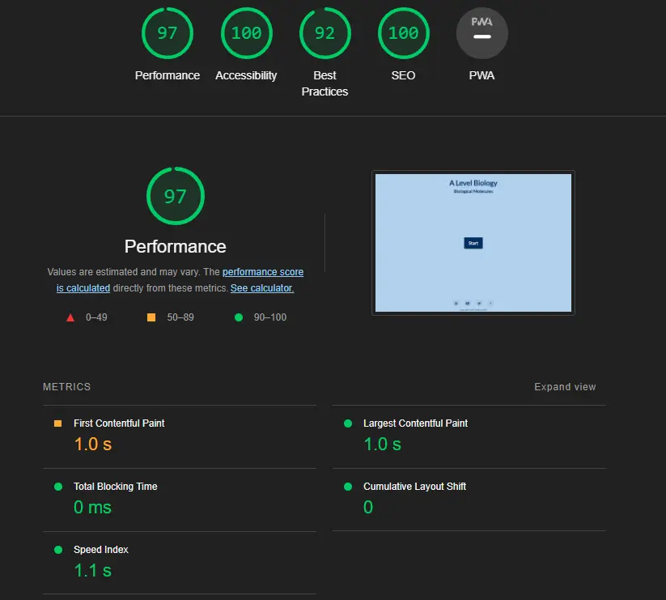

## Responsiveness
*   In order to fully test the responsiveness of the web application I performed further tests on different devices and browsers. These were:
    * Browsers:
      * Google Chrome
      * Safari
      * MS Edge
      * Firefox

    * Devices:
      * IPhone 14pro
      * IPhone 12 Mini
      * IPad Pro 12.9inc
      * Mac Laptop
      * Windows desktop PC
      * Windows Laptop

## Features Tested

| Feature      | Expected Outcome | Testing Performed    | Result | Pass or Fail |
|   :---       |      :----:      |        :----:        | :----: |    :----:    
| Start Button  | When clicked   test instructions   appear. | Clicked Start | Instructions shown   | Pass        |
| Quit Test Button  | When clicked   the Test ends   takes user to start.   | Clicked Quit | Navigate to start   | Pass        |
| Start Test Button | When clicked   Test window shown   the test begins   | Clicked Start | Test begins  | Pass        |
| Question Number | When test begins   question number displayed   counts up as you progress questions.| Moved through questions | Number counts up | Pass        |
| Timer Bar | When test begins   timer bar decreases.    | Started the test | Timer bar decreases | Pass        |
| Timer     | When test begins   timer decreases from 15   down to 0. | Started the test | Timer decreases  | Pass    |
| No answer selected | If no answer is   selected when timer   ends, correct answer   shown and no score acquired. | Did not select and answer | No point awarded and   correct answer shown | Pass    |
| Next Button | When test begins the   next button will only display when   an answer is selected   and when clicked takes   user to next questions. | Clicked answer | Next button appears and takes   user to next questions | Pass   |
| Results Window | After completing the Test   the results window will show. | Completed all questions | Results window shown | Pass    |
| Results Data | Results window shows total score   Percentage achieved and   what grade achieved. | Completed questions to get different scores | Correct score, percentage and   grade shown | Pass    |
|Restart Button | Click button to restart Test | Clicked restart | Test restarts | Pass  |
Social Media | Click social media icons takes   user to social media site. | Clicked social media icons. | Navigated to social media. | Pass  |

# Deployment

*   The website has been deployed to GitHub pages. This was accomplished by following the detailed steps below:
*   selecting settings in the GitHub repository.
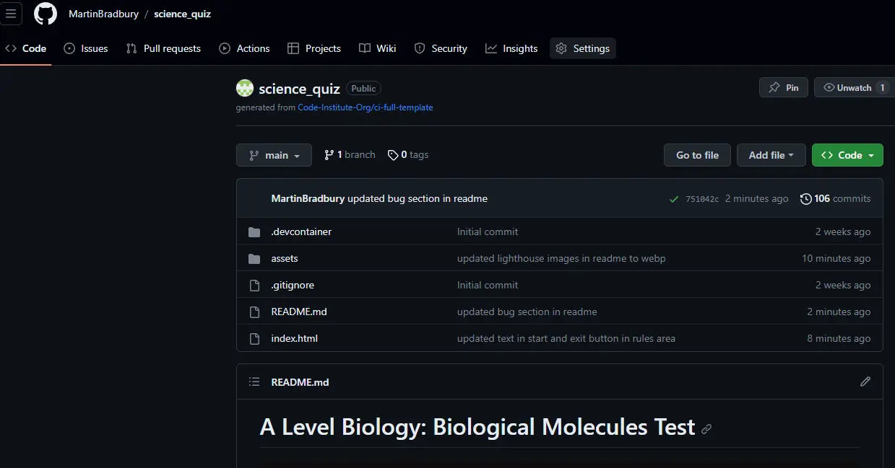

*  Navigate to the Pages tab on the left hand side of the screen.
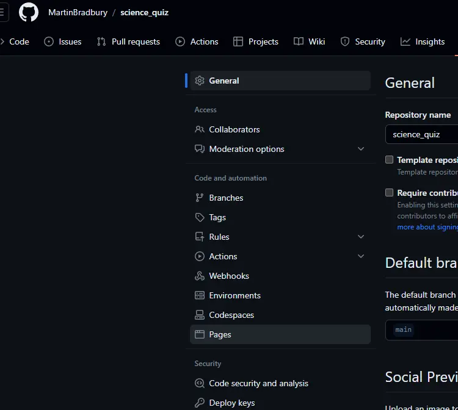

*  Select deploy from branch in the source section and ensure the main branch is selected in the branch.
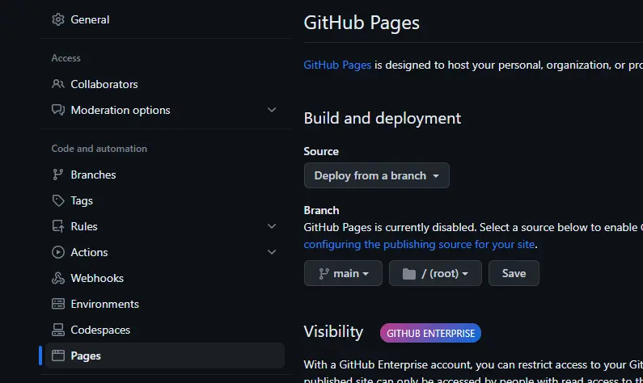

*   Finally click the save button and the page will be deployed to GitHub Pages.
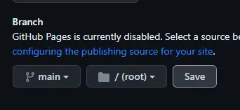

*   Once the website has been updated to the server, you will see your live URL link.
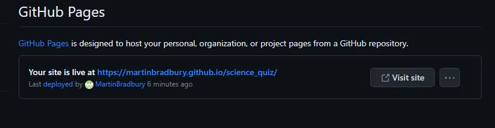

# Credits

* [W3Schools](https://www.w3schools.com/) was used as a general source of knowledge.
* [Loves Math project](https://learn.codeinstitute.net/dashboard)  was used as a general source of knowledge
* [CodingNepal](https://www.youtube.com/watch?v=WUBhpSRS_fk&t=1388s) Code was adapted from this source for the following features: Test general layout and navigation.
* [Open Source Coding](https://www.youtube.com/watch?v=LJ4PZ8JnRCg&t=1662s) Code was adapted from this source for the following features and ideas: Timer Bar.
* [Slack Overflow](https://stackoverflow.com/) Was used in the process of debugging the code.
* [MND Web Docs](#) was used as a general source of knowledge.

# Acknowledgements

* I would like to thank my mentor 'narender mentor' for the support and guidance throughout the project. He helped me push and challenge myself with the code through the project development.
* I would like to thank my colleagues on Slack who provide help, support and essential feedback.
* I would like to thank my family in supporting me on this journey and allowing me the time to dedicated to this project. 

# Modificatio following assesor feedback.

*   LO1 1.7 - 1.7	No	There is an insufficient amount of custom code present as most of the current code has been copied/adapted from the referenced tutorials. 
*   LO4 4.3 / 4.4 Where code has been copied/adapted from an external source (such as a tutorial), attributions should be added in comments above the relevant code, with a link to the source.
*   Merit Creteria 1.3 Most of the current code has been copied/adapted from the referenced tutorials. A significant amount of custom functionality is required to adequately demonstrate your abilities with JavaScript.
*   Further comments following Assesor feedback: . A scoreboard, difficulty options and/or using an API to generate questions would all work well.

## API to generate questions

*   I have written javascript to use an API to generate the questions for the quiz. As this is no longer a specific A Level Biology quiz, modifications have also been made to the quiz title as well as changing the instructions from test to quiz. 
*   I have also changed how the API questions and options are written to the HTML in the javascript.
   
*   The API i have used is a free open API (https://opentdb.com/api_config.php).
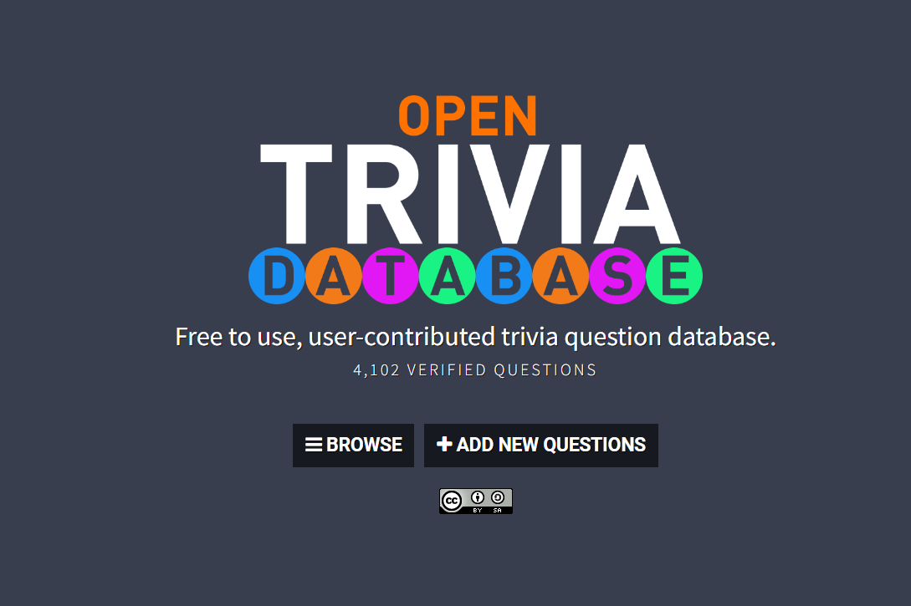

*   Modifications to the quiz heading can be seen below.
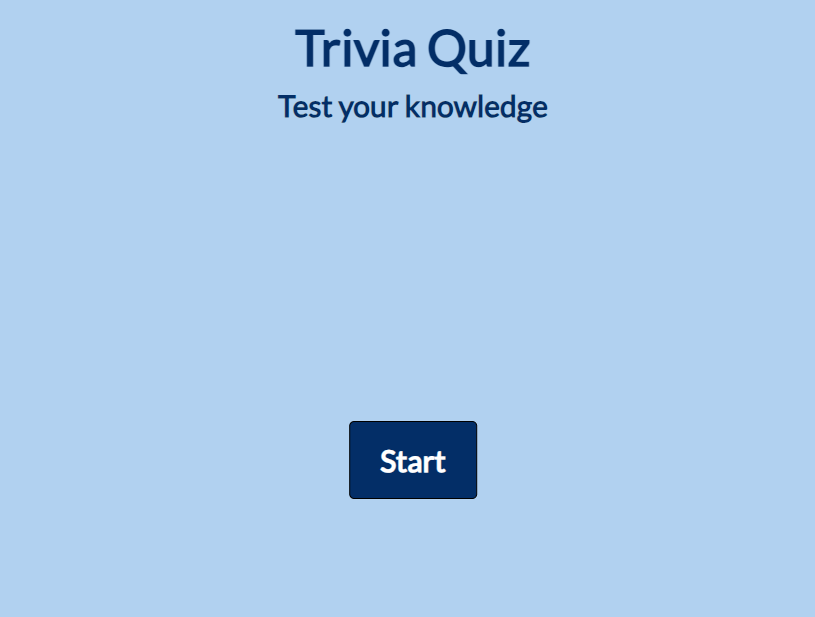

## Quiz categories

*   Following feedback I have written javascript to enable the user to play one of 4 different quizes on the open trivia DB. The category select follows the same style and presentation of the quiz and enable the user to select, science and nature, film, general knoweldge and video games. These options are displayed after the user reads the rules and click the cateogry button.
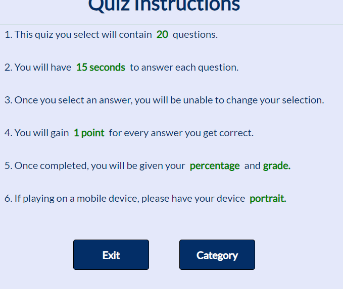

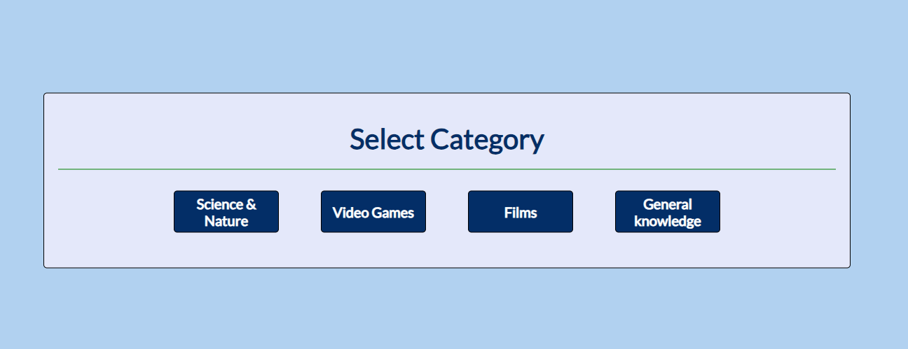

## Quiz difficulty

*   As well as being able to select the different quiz category, I have also given the user the opportunity to select the difficulty. This can be easy  medium or hard. On the selection the correct diffcculty questions for the category selected will be loaded into the quiz.
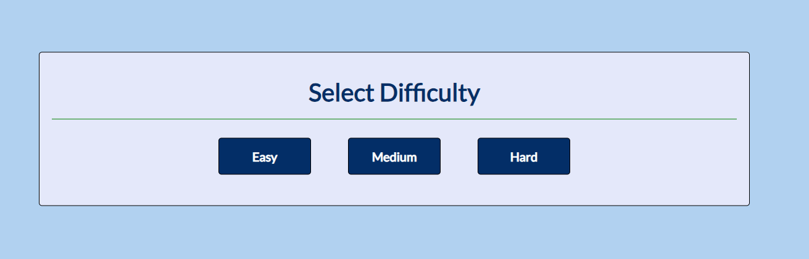

## Option array sort

*   I discovered a bug when using the API where sometimes more than 4 options would be displayed with one being repeated. I re wrote the shuffle options array javascript to ensure that there would always only be 4 options, 1 correct and 3 incorrect in a random position.

## Quiz Category Heading

*   To provide feedback to the user, I have also ensure that the quiz selected will appear above the timer line when the user is completing the quiz. This dynamically changes depending on the quiz selected. I looked at also displaying the difficulty but I felt that this made the header of the quiz look too cluttered and could be distracting. 
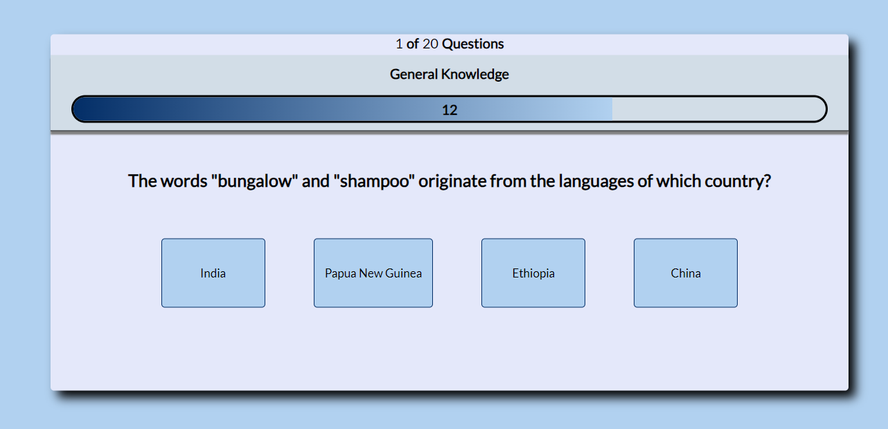

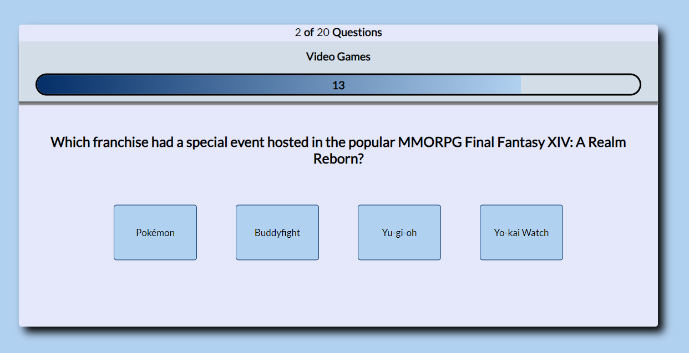

