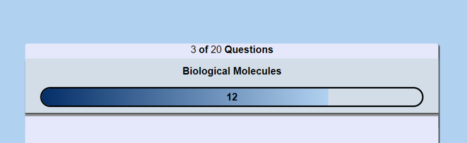
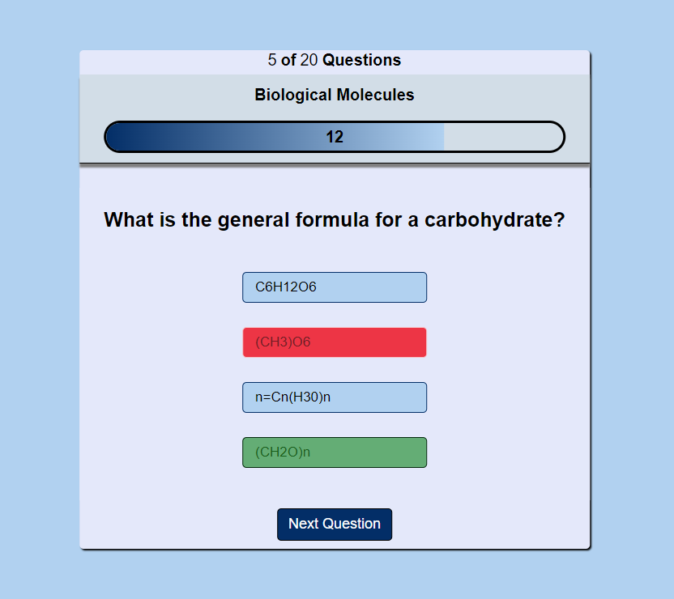
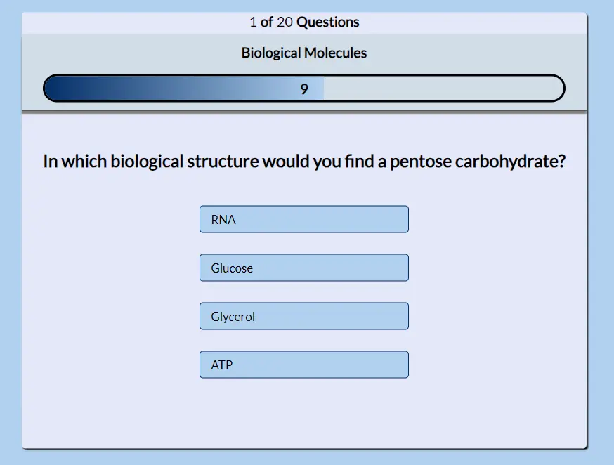
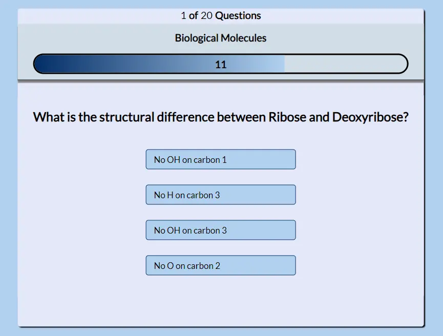
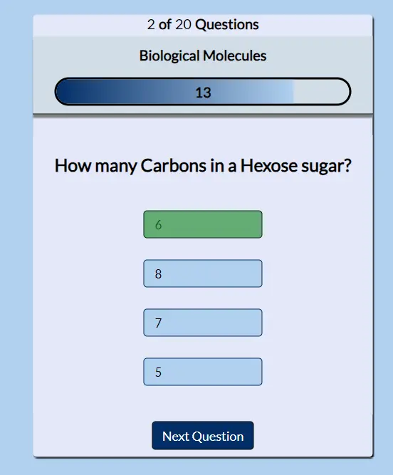
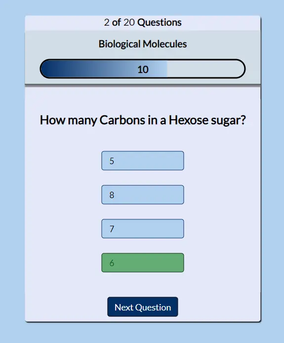
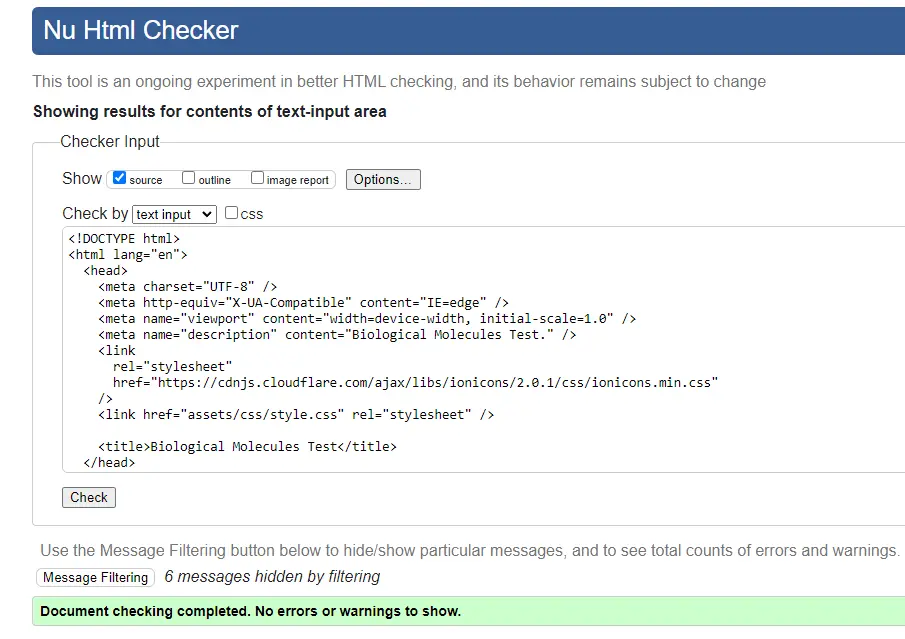
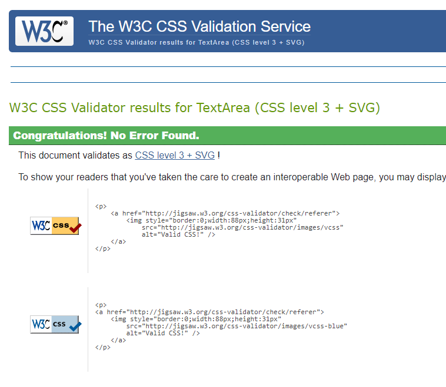
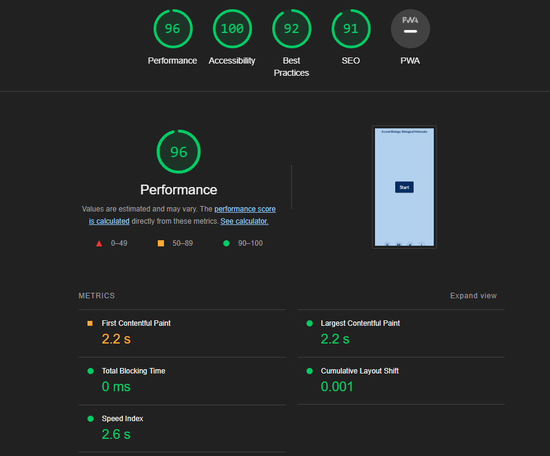
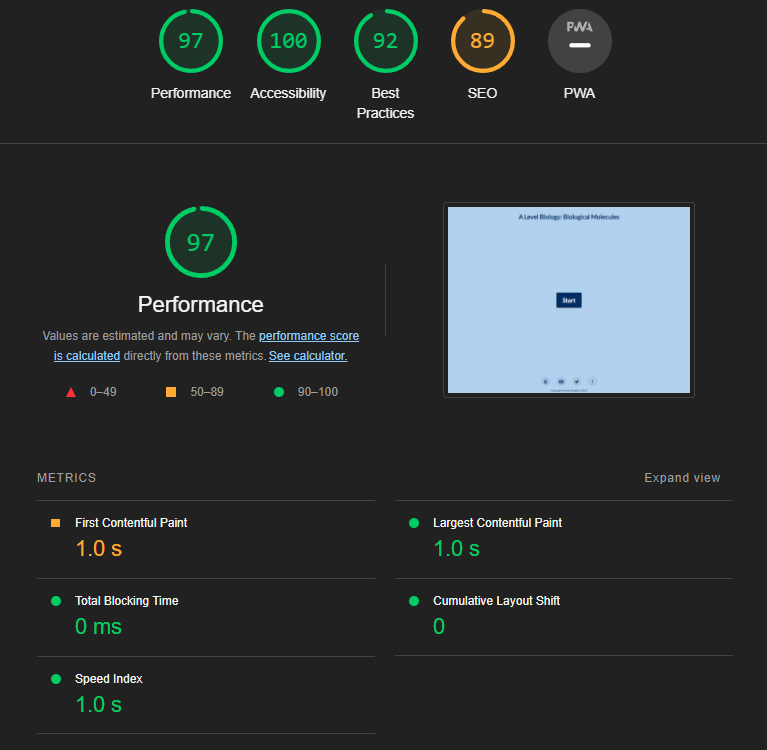

# A Level Biology: Biological Molecules Test

This interavtive A Level Biology Biological Molecules test is aimed at Year 12 and 13 students who want to test their knowledge on the topic of Biological Molecules. The test will consist of 20 questions and will test the users knowledge across Carbohydrates, Lipids and Water. The user will be faced with a questions in a random order and 4 possible options to selext from. Once selected the user will get instant feedback if they are correct or incorrect. If incorrect the correct answer will be displayed. FOr each question the user will get a maximum of 15 seconds to respond and this will be displayed as a number counting down and a timer bar that will decrease as the time progresses. At the end of the test the user will be able to see how many answers they got correct, what their perfentage is and a conversion of thet percentage into a grade based on typical A Level grade boundaries.

# Features

## Existing Features:

### Header and Footer
*   Header element detailing the quiz title and a interactive footer that will direct users to my social media sites.

### Interactive Start Button
*   The users will be greated on the home page with a interactive start button that has a hover effect and opens up the rules window when clicked.

  

### Question number in the Test Area
*   The users will see the question number they are on and how many euestions there are in the header of their test.

### Timer bar and number
*   The user will see how many seconds left there are to answer the current question. This will also be displayed in a timer bar.

### Seclecting correct answer
*   Selecting the correct answer will stop the timer and timer bar, display the answer as green and display a button to move to the next question

### Incorrect answer selection
*   Selecting an incorrect answer will stop the timer and the timer bar, display the incorrect answer selected as red and the correct answer green.

### Results Area
*   The results area will show the total number of questions correfct, calculate the percentage and use the percentage to generate a grede for the user based on OCR Alevel Biology Grade boundries.

### Random Question Order Generation
*   The 20 questions in the quiz appear in a random order every time the test is attempted to ensure the user does not just learn the sequence of answers.
 

### Random Answer Order Generation
*   The answers will appear in a random order for each question every time the test is appenpted. This ensures the user does not just learn the sequence of answers.

## Features Left To Implement and Future Development
### Below are features that I would like to integrate into the project:
*   Greater selection of questions and / or the use of an API to generate the questions.
*   Submit test result section. This will be very useful as a teacher if the students are able to submit their answers dirtectly to me and those answers could be tabilated.
*   Multiple topics for the suudents to choose from throughout the whole A level Biology specification.
*   Level of difficulty questions that the student can select which will inturn dictate the damand of the questions being asked.
*   Responsive test design which selects the next question based on the success of the student in the provious few questions.

## Wireframes

*	Main page:
[Design](assets/images/home.png) 
*	Instructions:
[Design](assets/images/instructions.png) 
*	Test Area:
[Design](assets/images/questions.png) 
*	Results Area:
[Design](assets/images/results.png) 

## Framework, Languages and Programs Used

1. [Bootstrap 4.1](https://getbootstrap.com/docs/4.1/getting-started/introduction/)
   *Bootstrap was used to help make the website more responsive and aid with the styling of the website.
  
2. [Google Fonts](https://fonts.google.com/)
   *Google Fonts was used to import different font styles to be used in styling of the website.
  
3. [Git](https://git-scm.com/)
   *Git was used to store the projects code after being pushed from Git.

4. [GitHub](https://github.com/)
   *GitHub is used to store the projects code after being pushed from Git.

5. [Adobe Xd](https://helpx.adobe.com/support/xd.html)
   *Xd was used to create the wire frames for the project.

6. [Javascript](https://www.javascript.com/)
   *Javascript was used to creat the interactive elements on the website and Quiz.

# Testing

## User Testing
*   The website and interactive quiz has been tested by me using google chrome developer tools, Iphone 14 Pro / Iphone 13 mini and Apple Ipad Pro 12.9. After deploying the website to GitHub pages the website has been tested by friends, family and students at my school to see how it works both on a desktop computer and the variety of mobile devices they own.

## Validator testing:

* [HTML:](https://validator.w3.org/)
    *   No errors were found when testing with the W3C HTML Validator. 

*   [CSS:](https://validator.w3.org/)
    *   No errors were found when testing with the W3C CSS Validator. 

*   [Javascript:](https://jshint.com/)
    *   No effors were found when testing with the JSHunt Validator. [JSValidator]
        * The following meterics were returned:
        * There are 16 functions in this file.
        * Function with the largest signature take 2 arguments, while the median is 0.
        * Largest function has 26 statements in it, while the median is 3.
        * The most complex function has a cyclomatic complexity value of 8 while the median is 1.

### Unfixed Bugs
*   On desktop, selecting a different browser tag during the test correctly continues the count down but the timer bar pauses. When the test tab is reselected, timer is correct but timerbar is not.

## Lighthouse results

I have used the developer tools in google chrome to test each page in my website for performance, accessibility, best practise and SEO. Below is an example of the homepage.

* Mobile

* Desktop

# Deployment

# Credits

